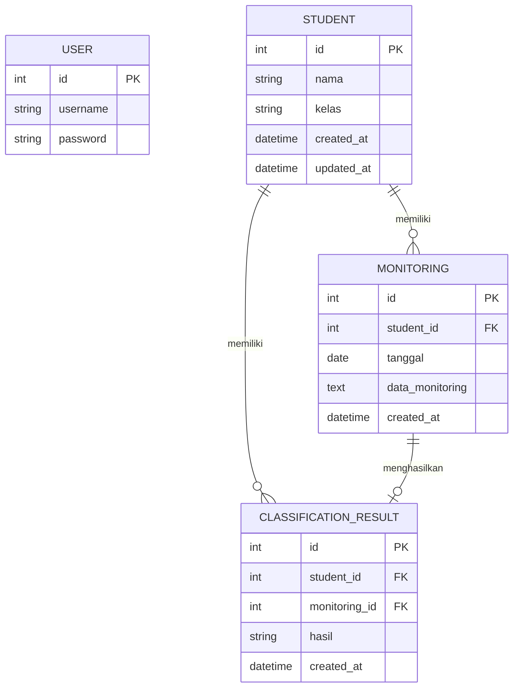

# Entity Relationship Diagram (ERD)

## Sistem Monitoring Evaluasi Belajar Siswa Berbasis Web

### 1. Tujuan

ERD digunakan untuk menggambarkan struktur data utama dan hubungan antarentitas pada Sistem Monitoring Evaluasi Belajar Siswa Berbasis Web Menggunakan Algoritma Decision Tree.

Rancangan ERD ini mengacu pada LLD awal dan digunakan sebagai dasar penyusunan skema database.

---

### 2. Entitas

| Entitas | Keterangan |
|---|---|
| USER | Menyimpan data pengguna sistem |
| STUDENT | Menyimpan data siswa |
| MONITORING | Menyimpan data monitoring siswa |
| CLASSIFICATION_RESULT | Menyimpan hasil klasifikasi Decision Tree |

---

### 3. ERD



---

### 4. Relasi Antarentitas

#### 4.1 STUDENT — MONITORING

Satu siswa dapat memiliki beberapa data monitoring.

```text
STUDENT 1 ---- N MONITORING
```

#### 4.2 STUDENT — CLASSIFICATION_RESULT

Satu siswa dapat memiliki beberapa hasil klasifikasi.

```text
STUDENT 1 ---- N CLASSIFICATION_RESULT
```

#### 4.3 MONITORING — CLASSIFICATION_RESULT

Satu data monitoring dapat menghasilkan satu hasil klasifikasi.

```text
MONITORING 1 ---- 0..1 CLASSIFICATION_RESULT
```

---

### 5. Primary Key dan Foreign Key

| Tabel | Primary Key | Foreign Key |
|---|---|---|
| USER | id | - |
| STUDENT | id | - |
| MONITORING | id | student_id → STUDENT.id |
| CLASSIFICATION_RESULT | id | student_id → STUDENT.id, monitoring_id → MONITORING.id |

---

### 6. Catatan Rancangan

Atribut `data_monitoring` masih menggunakan tipe `TEXT` sebagai rancangan awal karena atribut indikator monitoring final belum ditetapkan pada LLD.

Struktur atribut monitoring akan disesuaikan setelah indikator penelitian dan struktur dataset ditetapkan.

Kelas target Decision Tree juga belum ditentukan pada tahap LLD awal sehingga belum dimasukkan sebagai atribut khusus pada ERD.

---

### 7. Mapping Entitas dan API

| Entitas | Endpoint Terkait |
|---|---|
| USER | `POST /api/login` |
| STUDENT | `GET /api/students` |
| STUDENT | `POST /api/students` |
| STUDENT | `PUT /api/students/{id}` |
| STUDENT | `DELETE /api/students/{id}` |
| MONITORING | `POST /api/monitoring` |
| MONITORING | `GET /api/monitoring/history/{student_id}` |
| MONITORING | `GET /api/monitoring/summary` |
| MONITORING | `GET /api/monitoring/filter` |
| MONITORING | `GET /api/monitoring/export` |
| CLASSIFICATION_RESULT | `POST /api/classification` |

---

### 8. Keterkaitan dengan LLD

ERD ini mengacu pada rancangan database pada LLD awal, yaitu:

- USER
- STUDENT
- MONITORING
- CLASSIFICATION_RESULT

Relasi dan atribut pada ERD akan menjadi dasar untuk penyusunan skema data pada tahap berikutnya.

---

### 9. Status Rancangan

| Komponen | Status |
|---|---|
| Entitas utama | Selesai |
| Primary Key | Selesai |
| Foreign Key | Selesai |
| Relasi antarentitas | Selesai |
| Mapping API | Selesai |
| Atribut monitoring final | Belum final |
| Kelas target Decision Tree | Belum final |
