# HIGH-LEVEL DESIGN (HLD)

## Sistem Monitoring Evaluasi Belajar Siswa Berbasis Web Menggunakan Algoritma Decision Tree

**Versi:** 1.0  
**Status:** Draft Awal  
**Platform:** Web  
**Backend:** Python Flask  
**Database:** MySQL  
**Algoritma:** Decision Tree  
**API:** REST API  

---

# 1. Pendahuluan

## 1.1 Tujuan Dokumen

High-Level Design (HLD) merupakan dokumen yang menjelaskan rancangan sistem pada tingkat tinggi sebelum sistem masuk ke tahap implementasi.

Dokumen ini digunakan sebagai dasar untuk merancang Sistem Monitoring Evaluasi Belajar Siswa Berbasis Web Menggunakan Algoritma Decision Tree.

HLD mencakup:

1. Arsitektur sistem.
2. Diagram alur data.
3. Desain modul.
4. Spesifikasi API tingkat tinggi.
5. Alur proses Decision Tree.
6. Penanganan kesalahan sistem.
7. Keamanan dan privasi.
8. Dokumentasi penggunaan prompt AI dalam proses perancangan.

Dokumen ini belum membahas detail kode program, struktur class, method, maupun query SQL secara rinci. Detail tersebut akan dijelaskan pada dokumen Low-Level Design (LLD).

---

# 2. Tujuan Sistem

Sistem dirancang untuk membantu proses monitoring dan evaluasi belajar siswa melalui aplikasi berbasis web.

Sistem menyediakan fasilitas untuk:

- melakukan login pengguna;
- mengelola data siswa;
- mencatat data monitoring siswa;
- melakukan proses klasifikasi menggunakan Decision Tree;
- menampilkan hasil klasifikasi;
- melihat riwayat monitoring;
- melihat ringkasan monitoring;
- melakukan filtering data;
- melakukan export data.

Decision Tree digunakan sebagai algoritma klasifikasi dalam proses evaluasi data siswa.

---

# 3. Ruang Lingkup Sistem

Ruang lingkup sistem meliputi:

1. Authentication pengguna.
2. Pengelolaan data siswa.
3. Pengelolaan data monitoring.
4. Proses klasifikasi menggunakan Decision Tree.
5. Penyimpanan hasil klasifikasi.
6. Penampilan hasil evaluasi.
7. Riwayat monitoring siswa.
8. Ringkasan data monitoring.
9. Filtering data.
10. Export data.

Sistem dirancang berbasis web sehingga dapat diakses melalui browser.

---

# 4. Pengguna Sistem

Pengguna utama sistem adalah pengguna sekolah yang memiliki hak akses terhadap sistem sesuai dengan kebutuhan aplikasi.

## 4.1 Pengguna

Pengguna dapat melakukan:

- login;
- mengelola data siswa;
- mencatat data monitoring;
- menjalankan proses klasifikasi;
- melihat hasil klasifikasi;
- melihat riwayat monitoring;
- melihat ringkasan monitoring;
- melakukan filtering;
- melakukan export data.

Hak akses pengguna akan diterapkan berdasarkan kebutuhan sistem dan hasil analisis pada tahap implementasi.

---

# 5. Arsitektur Sistem

Sistem menggunakan arsitektur berbasis web dengan pola client-server.

Komponen utama sistem terdiri dari:

1. Web Client.
2. Flask Backend.
3. REST API.
4. Classification Service.
5. Decision Tree.
6. Database MySQL.

## 5.1 Diagram Arsitektur Sistem

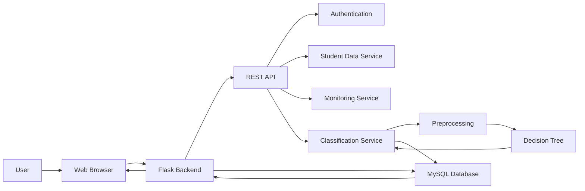

## 5.2 Penjelasan Arsitektur

### Web Client

Web Client merupakan bagian yang digunakan pengguna melalui browser.

Fungsinya:

- menampilkan halaman sistem;
- menerima input pengguna;
- mengirim request ke backend;
- menampilkan response dari backend.

### Flask Backend

Flask Backend merupakan pusat pemrosesan aplikasi.

Fungsinya:

- menerima request;
- melakukan validasi;
- mengelola proses bisnis;
- menghubungkan sistem dengan database;
- menjalankan proses klasifikasi;
- mengirim response kepada client.

### REST API

REST API digunakan sebagai penghubung antara Web Client dengan backend.

API menangani request dan response untuk fitur sistem.

### Classification Service

Classification Service mengatur proses klasifikasi data siswa menggunakan Decision Tree.

### Decision Tree

Decision Tree merupakan algoritma yang digunakan untuk melakukan proses klasifikasi berdasarkan data yang telah dipersiapkan.

### MySQL Database

MySQL digunakan untuk menyimpan data aplikasi, seperti data pengguna, data siswa, data monitoring, dan hasil klasifikasi.

---

# 6. Diagram Alur Data

## 6.1 Alur Data Utama

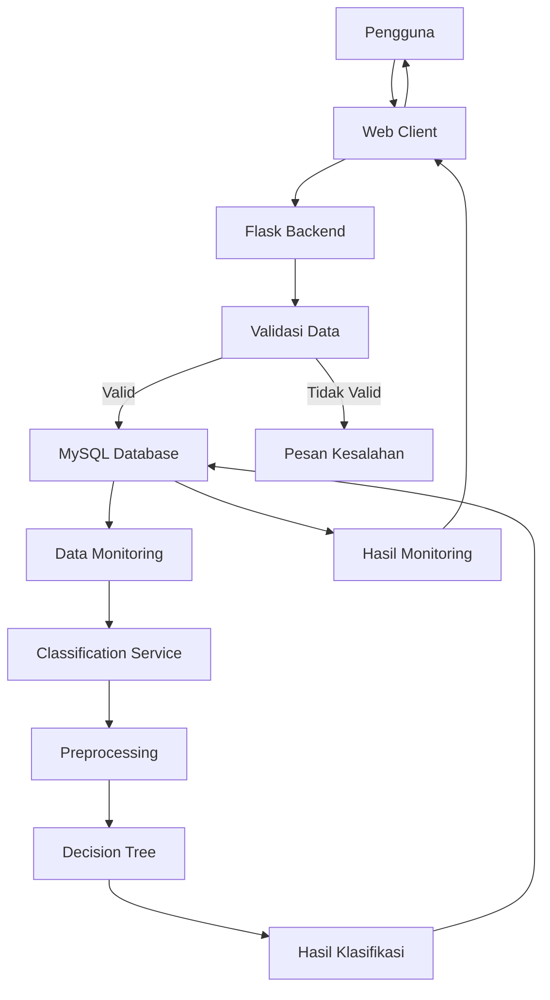

## 6.2 Penjelasan Alur Data

1. Pengguna mengakses sistem melalui browser.
2. Web Client mengirimkan request ke Flask Backend.
3. Backend melakukan validasi data.
4. Data yang valid diproses dan disimpan pada database.
5. Data monitoring digunakan sebagai input proses klasifikasi.
6. Classification Service melakukan preprocessing.
7. Data yang telah diproses diberikan kepada Decision Tree.
8. Decision Tree menghasilkan hasil klasifikasi.
9. Hasil klasifikasi disimpan ke database.
10. Hasil monitoring dikirim kembali kepada Web Client.
11. Pengguna dapat melihat hasil evaluasi.

---

# 7. Alur Proses Decision Tree

## 7.1 Diagram Proses Klasifikasi

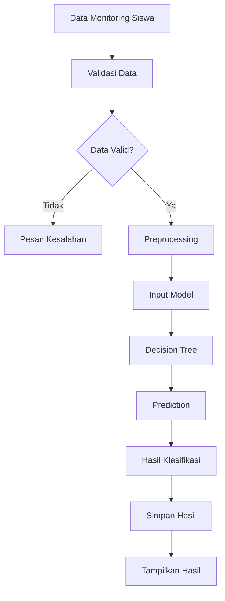

## 7.2 Tahapan Proses

### 1. Input Data

Data monitoring siswa dimasukkan melalui sistem.

### 2. Validasi

Sistem memeriksa kelengkapan dan format data.

### 3. Preprocessing

Data dipersiapkan agar sesuai dengan format input model.

### 4. Decision Tree

Data yang telah diproses diberikan kepada algoritma Decision Tree.

### 5. Prediction

Model menghasilkan kelas hasil klasifikasi.

### 6. Penyimpanan

Hasil klasifikasi disimpan ke database.

### 7. Tampilan Hasil

Hasil klasifikasi ditampilkan kepada pengguna melalui halaman web.

---

# 8. Desain Modul Sistem

Sistem dibagi menjadi beberapa modul utama.

| No | Modul | Fungsi |
|---|---|---|
| 1 | Authentication | Mengelola proses login pengguna |
| 2 | Student Management | Mengelola data siswa |
| 3 | Monitoring | Mengelola data monitoring siswa |
| 4 | Classification | Mengelola proses Decision Tree |
| 5 | Classification Result | Menampilkan hasil klasifikasi |
| 6 | Monitoring History | Menampilkan riwayat monitoring |
| 7 | Monitoring Summary | Menampilkan ringkasan monitoring |
| 8 | Filtering | Melakukan penyaringan data |
| 9 | Export | Menghasilkan data untuk kebutuhan export |

---

# 9. Desain Modul Authentication

## Fungsi

Modul Authentication digunakan untuk mengatur proses login pengguna.

## Input

- Username atau email.
- Password.

## Proses

1. Pengguna memasukkan data login.
2. Sistem melakukan validasi.
3. Sistem memeriksa kredensial.
4. Jika valid, pengguna dapat mengakses sistem.
5. Jika tidak valid, sistem menampilkan pesan kesalahan.

## Output

- Status login berhasil.
- Pesan kesalahan jika login gagal.

---

# 10. Desain Modul Student Management

## Fungsi

Modul Student Management digunakan untuk mengelola data siswa.

## Proses

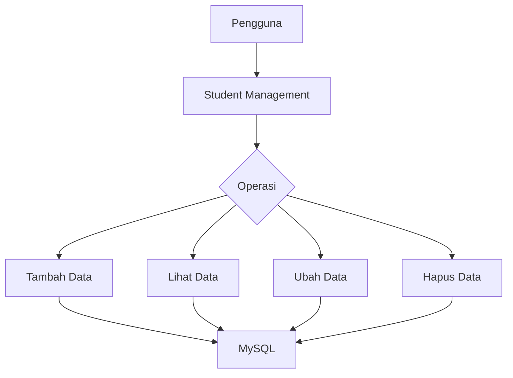

## Operasi

- Menambah data siswa.
- Melihat data siswa.
- Mengubah data siswa.
- Menghapus data siswa.

---

# 11. Desain Modul Monitoring

## Fungsi

Modul Monitoring digunakan untuk mencatat data monitoring siswa.

## Alur

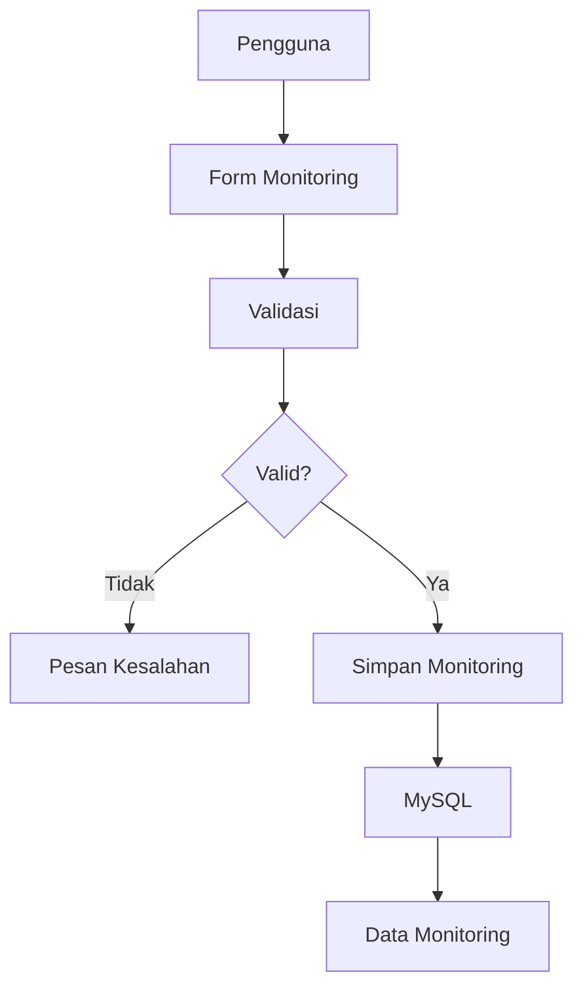

## Output

Data monitoring tersimpan dan dapat digunakan untuk proses evaluasi serta klasifikasi.

---

# 12. Desain Modul Classification

## Fungsi

Modul Classification digunakan untuk menjalankan algoritma Decision Tree.

## Alur

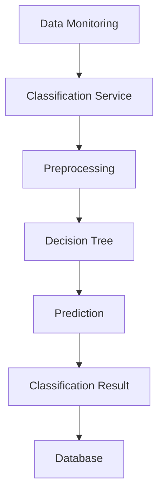

## Output

Output modul berupa hasil klasifikasi yang kemudian disimpan dan ditampilkan pada sistem.

---

# 13. Desain Modul Monitoring History

## Fungsi

Modul ini digunakan untuk melihat riwayat monitoring siswa.

Data yang ditampilkan dapat meliputi:

- identitas siswa;
- tanggal monitoring;
- data monitoring;
- hasil klasifikasi.

Data diambil dari database berdasarkan data monitoring yang tersimpan.

---

# 14. Desain Modul Monitoring Summary

## Fungsi

Modul ini digunakan untuk memberikan ringkasan data monitoring.

Alur:

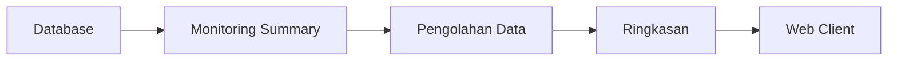

---

# 15. Desain Modul Filtering

## Fungsi

Modul Filtering digunakan untuk menyaring data berdasarkan parameter yang tersedia pada sistem.

Alur:

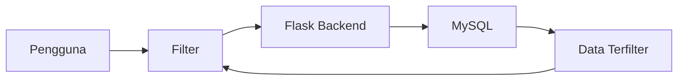

---

# 16. Desain Modul Export

## Fungsi

Modul Export digunakan untuk menyediakan data monitoring dalam bentuk file yang dapat digunakan sesuai kebutuhan sistem.

Alur:

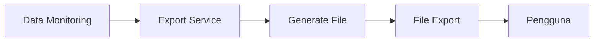

Format file export ditentukan pada tahap implementasi berdasarkan kebutuhan sistem.

---

# 17. Spesifikasi API

API menggunakan pendekatan REST API.

Format response menggunakan JSON.

## 17.1 Login

### Endpoint

```text
POST /api/login
```

### Request

```json
{
    "username": "user",
    "password": "password"
}
```

### Response Berhasil

```json
{
    "status": "success",
    "message": "Login berhasil"
}
```

### Response Gagal

```json
{
    "status": "error",
    "message": "Username atau password tidak valid"
}
```

---

# 18. API Data Siswa

## 18.1 Menampilkan Data Siswa

```text
GET /api/students
```

### Response

```json
{
    "status": "success",
    "data": []
}
```

## 18.2 Menambahkan Data Siswa

```text
POST /api/students
```

### Request

```json
{
    "nama": "Nama Siswa",
    "kelas": "VI"
}
```

### Response

```json
{
    "status": "success",
    "message": "Data siswa berhasil ditambahkan"
}
```

## 18.3 Mengubah Data Siswa

```text
PUT /api/students/{id}
```

### Request

```json
{
    "nama": "Nama Siswa",
    "kelas": "VI"
}
```

## 18.4 Menghapus Data Siswa

```text
DELETE /api/students/{id}
```

---

# 19. API Monitoring

## 19.1 Menambahkan Data Monitoring

```text
POST /api/monitoring
```

### Request

```json
{
    "student_id": 1,
    "tanggal": "2026-09-26",
    "data_monitoring": {}
}
```

### Response

```json
{
    "status": "success",
    "message": "Data monitoring berhasil disimpan"
}
```

---

# 20. API Classification

## Endpoint

```text
POST /api/classification
```

## Request

```json
{
    "student_id": 1,
    "monitoring_id": 1
}
```

## Response Berhasil

```json
{
    "status": "success",
    "result": "hasil klasifikasi"
}
```

## Response Gagal

```json
{
    "status": "error",
    "message": "Proses klasifikasi gagal"
}
```

---

# 21. API Monitoring History

## Endpoint

```text
GET /api/monitoring/history/{student_id}
```

## Response

```json
{
    "status": "success",
    "data": []
}
```

API digunakan untuk mengambil riwayat monitoring berdasarkan siswa.

---

# 22. API Monitoring Summary

## Endpoint

```text
GET /api/monitoring/summary
```

## Response

```json
{
    "status": "success",
    "data": {}
}
```

---

# 23. API Filtering

## Endpoint

```text
GET /api/monitoring/filter
```

Parameter filter disesuaikan dengan kebutuhan sistem.

Contoh:

```text
GET /api/monitoring/filter?kelas=VI
```

---

# 24. API Export

## Endpoint

```text
GET /api/monitoring/export
```

API digunakan untuk menghasilkan data monitoring dalam format file yang ditentukan pada tahap implementasi.

---

# 25. Standar Response API

Response API menggunakan format JSON.

## Response Berhasil

```json
{
    "status": "success",
    "message": "Request berhasil",
    "data": {}
}
```

## Response Gagal

```json
{
    "status": "error",
    "message": "Terjadi kesalahan"
}
```

---

# 26. Penanganan Error

Sistem menyediakan penanganan error untuk menjaga proses aplikasi tetap terkontrol.

| HTTP Status | Kondisi |
|---|---|
| 200 | Request berhasil |
| 201 | Data berhasil dibuat |
| 400 | Request tidak valid |
| 401 | Pengguna belum terautentikasi |
| 403 | Akses tidak diizinkan |
| 404 | Data atau endpoint tidak ditemukan |
| 422 | Data tidak dapat diproses |
| 500 | Kesalahan server |

## Alur Error

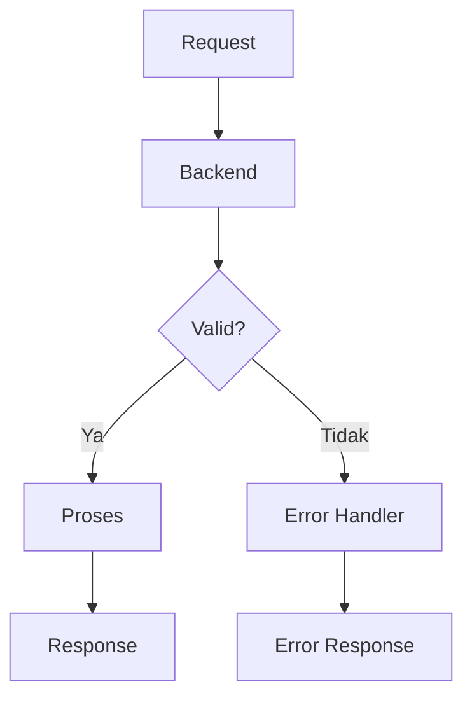

---

# 27. Keamanan Sistem

Keamanan sistem dirancang dengan beberapa mekanisme dasar:

1. Authentication untuk membatasi akses pengguna.
2. Validasi input pada backend.
3. Password tidak disimpan dalam bentuk teks biasa.
4. Hak akses pengguna diterapkan sesuai kebutuhan.
5. API melakukan validasi terhadap request.
6. Data siswa tidak diberikan kepada pengguna yang tidak memiliki hak akses.

---

# 28. Privasi Data

Sistem menangani data siswa sehingga privasi perlu diperhatikan.

Prinsip yang digunakan:

- data hanya digunakan untuk kebutuhan sistem;
- akses data dibatasi berdasarkan hak akses;
- data tidak dikirim ke layanan AI eksternal;
- data yang tidak diperlukan tidak dikumpulkan;
- informasi sensitif tidak ditampilkan secara berlebihan.

Decision Tree dijalankan pada sisi backend sehingga data monitoring tidak perlu dikirim ke layanan AI eksternal.

---

# 29. Logging Sistem

Logging digunakan untuk membantu proses pemantauan dan troubleshooting.

Aktivitas yang dapat dicatat:

- percobaan login;
- error API;
- error database;
- error proses klasifikasi;
- kegagalan pemuatan model;
- error sistem.

Data pribadi siswa tidak dicatat ke dalam log secara berlebihan.

---

# 30. Teknologi yang Digunakan

| Komponen | Teknologi |
|---|---|
| Frontend | HTML, CSS, JavaScript |
| Backend | Python Flask |
| API | REST API |
| Database | MySQL |
| Machine Learning | Decision Tree |
| Browser | Google Chrome / browser modern |
| Development | Visual Studio Code |

---

# 31. Deployment

Pada tahap pengembangan, sistem dijalankan pada lingkungan lokal.

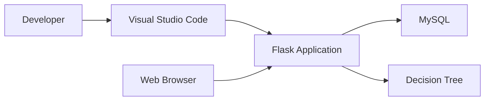

Tahap deployment produksi akan ditentukan setelah proses pengembangan dan pengujian selesai.

---

# 32. Traceability dengan Requirement

Rancangan HLD harus tetap terhubung dengan requirement sistem.

| Requirement | Modul HLD |
|---|---|
| FR-01 Authentication | Authentication |
| FR-02 Manage Student Data | Student Management |
| FR-03 Record Monitoring Data | Monitoring |
| FR-04 Decision Tree Classification | Classification |
| FR-05 Display Classification Result | Classification Result |
| FR-06 Monitoring History | Monitoring History |
| FR-07 Monitoring Summary | Monitoring Summary |
| FR-08 Classification Attributes | Classification |
| FR-09 Filtering | Filtering |
| FR-10 Export | Export |

ID requirement mengikuti requirement yang digunakan pada dokumen proyek.

---

# 33. Dokumentasi Penggunaan Prompt AI

AI digunakan sebagai alat bantu dalam proses perancangan sistem.

AI tidak digunakan untuk menggantikan keputusan perancangan, tetapi digunakan untuk membantu:

- menyusun struktur HLD;
- mengidentifikasi komponen sistem;
- membuat rancangan alur data;
- menyusun rancangan modul;
- menyusun contoh kontrak API;
- memeriksa konsistensi antara requirement dan desain;
- membantu dokumentasi.

Prompt yang digunakan dan hasil penggunaannya didokumentasikan pada file:

```text
docs/design/prompt-log.md
```

## 33.1 Alur Penggunaan AI

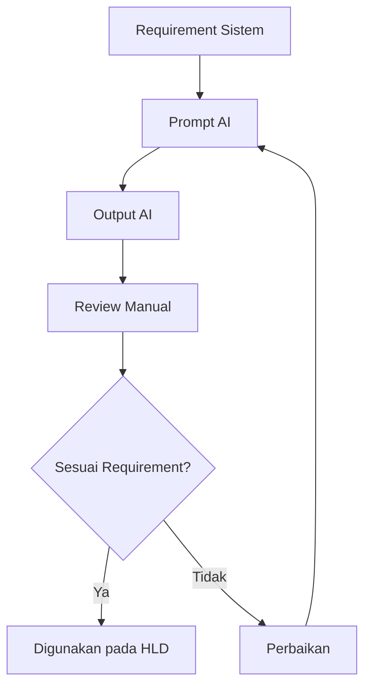

## 33.2 Prinsip Penggunaan AI

Dalam proses perancangan digunakan beberapa prinsip:

1. AI digunakan sebagai alat bantu.
2. Requirement tidak boleh diubah secara otomatis tanpa pemeriksaan.
3. Output AI diperiksa kembali oleh pengembang.
4. Informasi yang tidak tersedia tidak boleh dianggap sebagai fakta.
5. Keputusan teknis yang belum ditentukan diberi status draft atau asumsi.
6. Prompt dan hasil penting dicatat pada `prompt-log.md`.

---

# 34. Keputusan Arsitektur

Keputusan arsitektur utama:

| Keputusan | Pilihan |
|---|---|
| Platform | Web |
| Backend | Flask |
| Database | MySQL |
| API | REST API |
| Algoritma | Decision Tree |
| Pemrosesan model | Backend |
| Penyimpanan data | MySQL |

Decision Tree ditempatkan pada backend karena merupakan bagian dari proses klasifikasi utama sistem.

---

# 35. Batasan HLD

HLD ini hanya menjelaskan rancangan sistem pada tingkat tinggi.

HLD tidak membahas secara rinci:

- source code;
- class;
- method;
- query SQL;
- struktur folder secara lengkap;
- konfigurasi server secara detail;
- detail implementasi algoritma;
- detail dataset.

Detail tersebut akan dibahas pada dokumen Low-Level Design (LLD).

---

# 36. Checklist HLD

| Kebutuhan Dosen | Status |
|---|---|
| Arsitektur sistem | Selesai |
| Diagram alur data | Selesai |
| Desain modul | Selesai |
| Spesifikasi API | Selesai |
| Dokumentasi prompt AI | Selesai |
| Alur Decision Tree | Selesai |
| Penanganan error | Selesai |
| Keamanan | Selesai |
| Deployment | Selesai |
| Traceability requirement | Selesai |

---

# 37. Referensi

Sutoyo, I. (2018). Implementasi Algoritma Decision Tree untuk Klasifikasi Data Peserta Didik. *Jurnal PILAR Nusa Mandiri*, 14(2), 217–224.
