# LOW-LEVEL DESIGN (LLD) AWAL

## Sistem Monitoring Evaluasi Belajar Siswa Berbasis Web Menggunakan Algoritma Decision Tree

**Versi:** 1.0  
**Status:** Draft Awal  
**Platform:** Web  
**Backend:** Python Flask  
**Database:** MySQL  
**Algoritma:** Decision Tree  
**API:** REST API  

---

# 1. Tujuan Dokumen

Low-Level Design (LLD) Awal merupakan dokumen yang menjelaskan rancangan teknis sistem secara lebih detail berdasarkan High-Level Design (HLD).

LLD digunakan sebagai acuan awal sebelum proses implementasi sistem.

Dokumen ini menjelaskan:

1. Struktur modul.
2. Tanggung jawab setiap modul.
3. Alur proses setiap modul.
4. Struktur data utama.
5. Rancangan database.
6. Spesifikasi API.
7. Alur proses Decision Tree.
8. Validasi data.
9. Penanganan error.
10. Traceability antara requirement dan desain.

LLD ini masih berupa rancangan awal sehingga detail implementasi dapat disesuaikan setelah requirement, dataset, dan struktur sistem final ditetapkan.

---

# 2. Hubungan HLD dan LLD

HLD menjelaskan sistem pada tingkat arsitektur, sedangkan LLD menjelaskan bagaimana setiap komponen tersebut dirancang secara lebih detail.

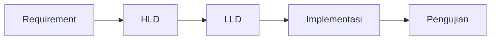

---

# 3. Struktur Modul Sistem

Sistem dibagi menjadi beberapa modul utama.

| No | Modul | Tanggung Jawab |
|---|---|---|
| 1 | Authentication | Mengelola login dan autentikasi |
| 2 | Student Management | Mengelola data siswa |
| 3 | Monitoring | Mengelola data monitoring |
| 4 | Classification | Menjalankan Decision Tree |
| 5 | Classification Result | Mengelola hasil klasifikasi |
| 6 | Monitoring History | Menampilkan riwayat monitoring |
| 7 | Monitoring Summary | Menampilkan ringkasan monitoring |
| 8 | Filtering | Menyaring data |
| 9 | Export | Menghasilkan data export |

---

# 4. Struktur Komponen Backend

Rancangan awal struktur backend menggunakan Flask.

```text
project/
│
├── app.py
│
├── routes/
│   ├── auth.py
│   ├── students.py
│   ├── monitoring.py
│   └── classification.py
│
├── services/
│   ├── auth_service.py
│   ├── student_service.py
│   ├── monitoring_service.py
│   └── classification_service.py
│
├── models/
│   ├── user.py
│   ├── student.py
│   └── monitoring.py
│
├── ml/
│   ├── preprocessing.py
│   ├── decision_tree.py
│   └── model/
│
├── database/
│   └── connection.py
│
└── utils/
    ├── validation.py
    └── error_handler.py
```

Struktur folder tersebut merupakan rancangan awal dan dapat disesuaikan dengan implementasi akhir.

---

# 5. Modul Authentication

## 5.1 Tujuan

Modul Authentication digunakan untuk melakukan proses login pengguna sebelum mengakses fitur sistem.

## 5.2 Input

```text
username
password
```

## 5.3 Proses

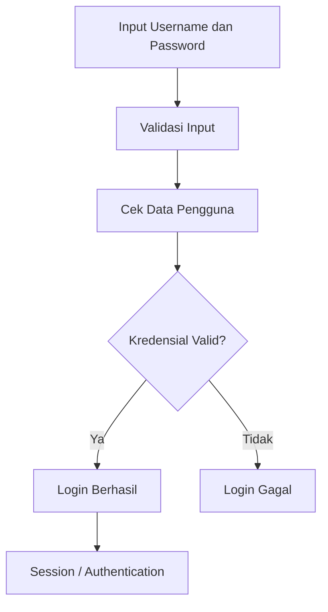

## 5.4 Output

Login berhasil:

```json
{
    "status": "success",
    "message": "Login berhasil"
}
```

Login gagal:

```json
{
    "status": "error",
    "message": "Username atau password tidak valid"
}
```

---

# 6. Modul Student Management

## 6.1 Tujuan

Modul Student Management digunakan untuk mengelola data siswa.

## 6.2 Operasi

Modul menyediakan operasi:

- Create;
- Read;
- Update;
- Delete.

## 6.3 Alur

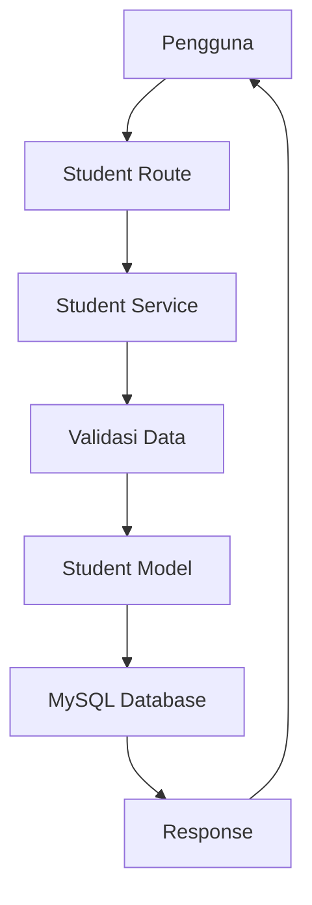

## 6.4 Data Input Awal

Struktur data siswa dirancang dengan atribut utama:

| Field | Tipe | Keterangan |
|---|---|---|
| id | INT | ID siswa |
| nama | VARCHAR | Nama siswa |
| kelas | VARCHAR | Kelas siswa |
| created_at | DATETIME | Waktu data dibuat |
| updated_at | DATETIME | Waktu data diperbarui |

Detail atribut dapat disesuaikan dengan kebutuhan sekolah.

---

# 7. Modul Monitoring

## 7.1 Tujuan

Modul Monitoring digunakan untuk mencatat data monitoring siswa.

## 7.2 Alur

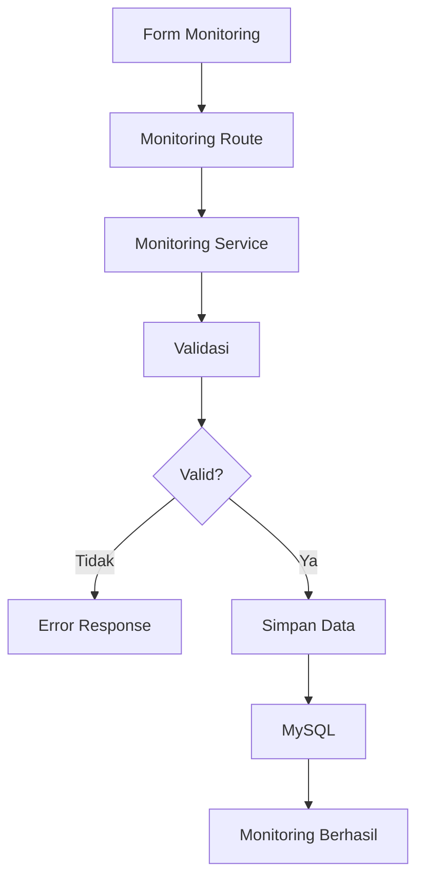

## 7.3 Struktur Data Awal

| Field | Tipe | Keterangan |
|---|---|---|
| id | INT | ID monitoring |
| student_id | INT | ID siswa |
| tanggal | DATE | Tanggal monitoring |
| data_monitoring | JSON/TEXT | Data monitoring |
| created_at | DATETIME | Waktu pencatatan |

Struktur atribut monitoring final ditentukan berdasarkan requirement dan indikator yang digunakan dalam penelitian.

---

# 8. Modul Classification

## 8.1 Tujuan

Modul Classification digunakan untuk menjalankan proses klasifikasi menggunakan algoritma Decision Tree.

## 8.2 Komponen

Modul Classification terdiri dari:

1. Input Data.
2. Validation.
3. Preprocessing.
4. Model Decision Tree.
5. Prediction.
6. Result Processing.
7. Penyimpanan hasil.

## 8.3 Alur

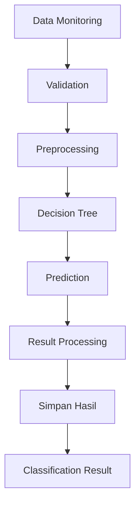

---

# 9. Preprocessing

## 9.1 Tujuan

Preprocessing digunakan untuk mempersiapkan data sebelum diberikan kepada Decision Tree.

## 9.2 Tahapan

Tahapan awal preprocessing:

1. Memeriksa data kosong.
2. Memeriksa format data.
3. Memastikan atribut sesuai dengan input model.
4. Mengubah data kategorikal ke bentuk yang diperlukan model apabila diperlukan.

## 9.3 Alur

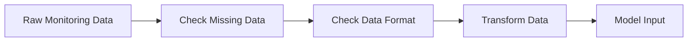

Detail preprocessing final ditentukan setelah struktur dataset ditetapkan.

---

# 10. Decision Tree

## 10.1 Tujuan

Decision Tree digunakan untuk melakukan klasifikasi berdasarkan data yang telah dipersiapkan.

## 10.2 Alur Model

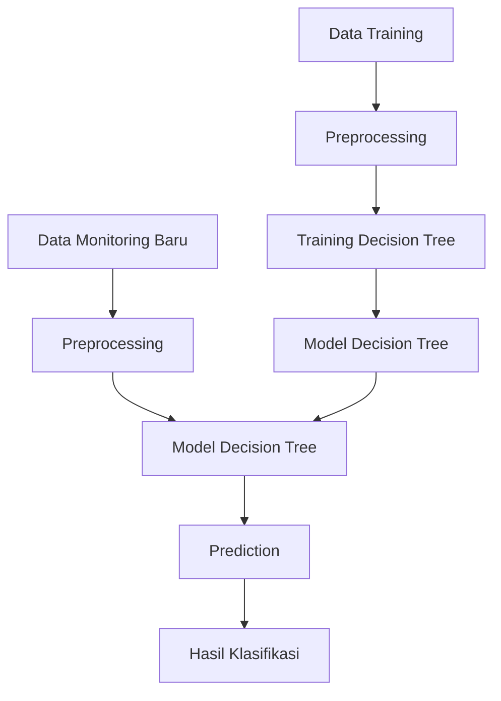

## 10.3 Input

Input model berupa data monitoring yang telah melewati tahap preprocessing.

## 10.4 Output

Output berupa kelas hasil klasifikasi.

Format hasil:

```json
{
    "prediction": "hasil klasifikasi"
}
```

Kelas akhir disesuaikan dengan dataset dan hasil analisis penelitian.

---

# 11. Training dan Prediction

Proses Decision Tree dibagi menjadi dua bagian utama.

## 11.1 Training

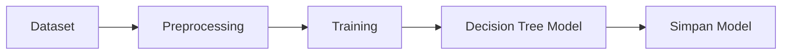

## 11.2 Prediction

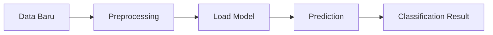

Model yang telah dilatih digunakan untuk melakukan prediction terhadap data baru.

---

# 12. Modul Classification Result

## 12.1 Tujuan

Modul ini digunakan untuk menyimpan dan menampilkan hasil klasifikasi.

## 12.2 Struktur Data Awal

| Field | Tipe | Keterangan |
|---|---|---|
| id | INT | ID hasil |
| student_id | INT | ID siswa |
| monitoring_id | INT | ID monitoring |
| hasil | VARCHAR | Hasil klasifikasi |
| created_at | DATETIME | Waktu hasil dibuat |

---

# 13. Modul Monitoring History

## 13.1 Tujuan

Menampilkan data monitoring dan hasil klasifikasi berdasarkan riwayat siswa.

## 13.2 Alur

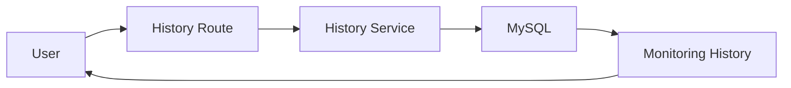

---

# 14. Modul Monitoring Summary

## 14.1 Tujuan

Modul digunakan untuk menampilkan ringkasan data monitoring.

## 14.2 Alur


---

# 15. Modul Filtering

## 15.1 Tujuan

Filtering digunakan untuk membantu pengguna menemukan data berdasarkan parameter tertentu.

Contoh parameter:

- kelas;
- siswa;
- tanggal;
- hasil klasifikasi.

Parameter akhir disesuaikan dengan requirement sistem.

## 15.2 Alur

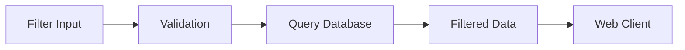

---

# 16. Modul Export

## 16.1 Tujuan

Modul Export digunakan untuk menghasilkan data monitoring yang telah dipilih pengguna.

## 16.2 Alur

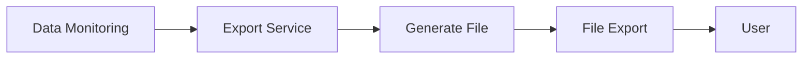

Format file final ditentukan pada tahap implementasi.

---

# 17. Rancangan Database

## 17.1 Entitas Utama

Database awal terdiri dari beberapa entitas:

1. User.
2. Student.
3. Monitoring.
4. Classification Result.

## 17.2 Relasi Data

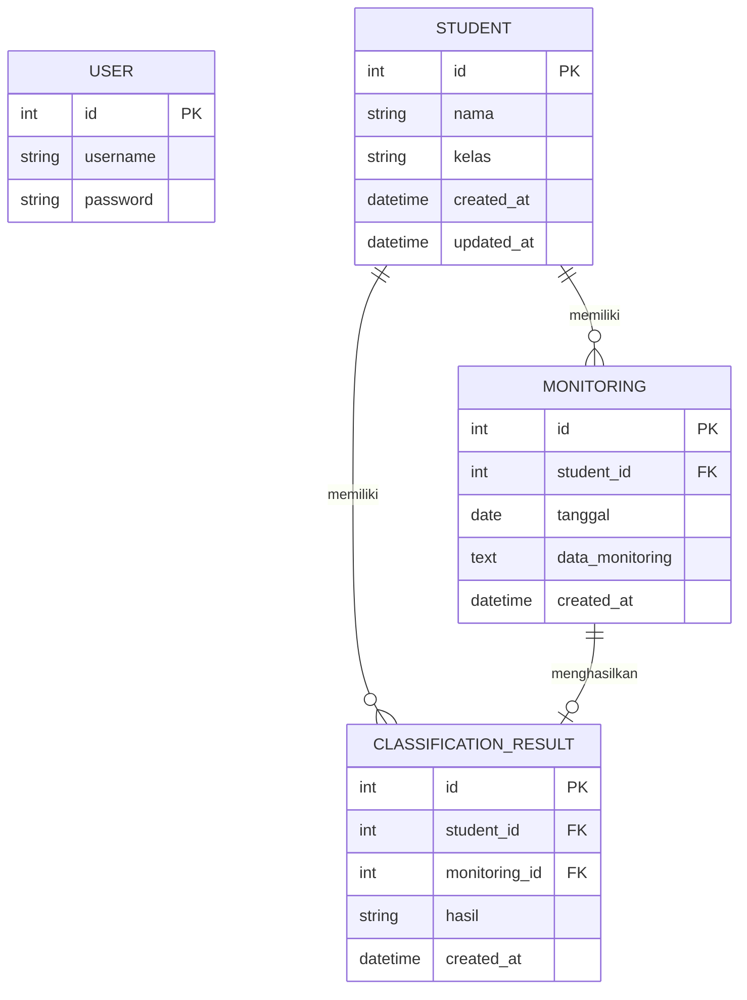

---

# 18. Validasi Data

Validasi dilakukan sebelum data diproses atau disimpan.

## 18.1 Validasi Data Siswa

Validasi meliputi:

- nama tidak kosong;
- kelas tidak kosong;
- format data sesuai.

## 18.2 Validasi Monitoring

Validasi meliputi:

- siswa harus tersedia;
- tanggal harus valid;
- atribut monitoring harus sesuai format;
- data wajib tidak boleh kosong.

## 18.3 Validasi Classification

Sebelum klasifikasi:

- student_id harus tersedia;
- monitoring_id harus tersedia;
- data input model harus lengkap;
- model harus tersedia.

---

# 19. Spesifikasi API Detail

## 19.1 Authentication

### Login

```text
POST /api/login
```

Request:

```json
{
    "username": "user",
    "password": "password"
}
```

Response:

```json
{
    "status": "success",
    "message": "Login berhasil"
}
```

---

## 19.2 Student

### Get Students

```text
GET /api/students
```

Response:

```json
{
    "status": "success",
    "data": []
}
```

### Create Student

```text
POST /api/students
```

Request:

```json
{
    "nama": "Nama Siswa",
    "kelas": "VI"
}
```

### Update Student

```text
PUT /api/students/{id}
```

### Delete Student

```text
DELETE /api/students/{id}
```

---

# 20. API Monitoring

### Create Monitoring

```text
POST /api/monitoring
```

Request:

```json
{
    "student_id": 1,
    "tanggal": "2026-09-26",
    "data_monitoring": {}
}
```

Response:

```json
{
    "status": "success",
    "message": "Data monitoring berhasil disimpan"
}
```

---

# 21. API Classification

### Classification

```text
POST /api/classification
```

Request:

```json
{
    "student_id": 1,
    "monitoring_id": 1
}
```

Response:

```json
{
    "status": "success",
    "result": "hasil klasifikasi"
}
```

---

# 22. API History

```text
GET /api/monitoring/history/{student_id}
```

Response:

```json
{
    "status": "success",
    "data": []
}
```

---

# 23. API Summary

```text
GET /api/monitoring/summary
```

Response:

```json
{
    "status": "success",
    "data": {}
}
```

---

# 24. API Filtering

```text
GET /api/monitoring/filter
```

Contoh:

```text
GET /api/monitoring/filter?kelas=VI
```

Response:

```json
{
    "status": "success",
    "data": []
}
```

---

# 25. API Export

```text
GET /api/monitoring/export
```

Response berupa file hasil export sesuai format yang ditentukan pada implementasi.

---

# 26. Penanganan Error

Sistem menggunakan HTTP status code untuk memberikan informasi mengenai hasil request.

| Status | Keterangan |
|---|---|
| 200 | Request berhasil |
| 201 | Data berhasil dibuat |
| 400 | Request tidak valid |
| 401 | Belum terautentikasi |
| 403 | Akses ditolak |
| 404 | Data tidak ditemukan |
| 422 | Data tidak dapat diproses |
| 500 | Kesalahan server |

## 26.1 Alur Error

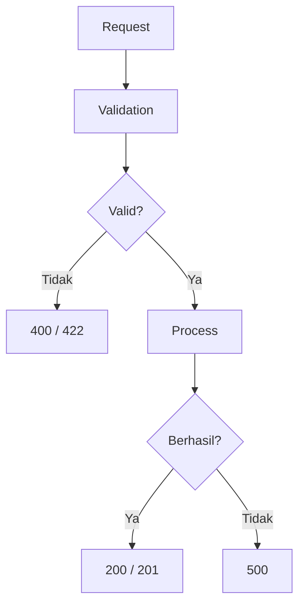

---

# 27. Penanganan Kegagalan Decision Tree

Kegagalan dapat terjadi apabila:

- model tidak ditemukan;
- model gagal dimuat;
- data input tidak lengkap;
- data tidak sesuai format;
- proses prediction mengalami error.

## 27.1 Alur

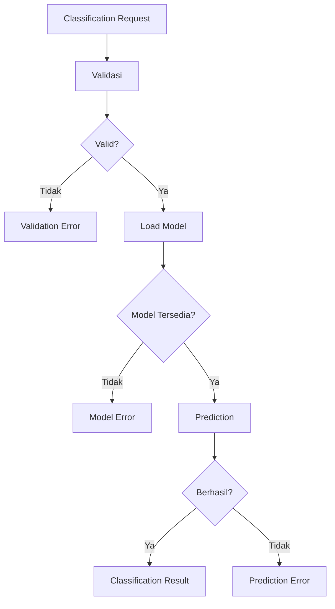

Sistem tidak menyimpan hasil klasifikasi apabila proses prediction gagal.

---

# 28. Traceability Requirement dan Modul

| Requirement | Modul | Komponen |
|---|---|---|
| FR-01 | Authentication | Auth Service |
| FR-02 | Student Management | Student Service |
| FR-03 | Monitoring | Monitoring Service |
| FR-04 | Classification | Classification Service |
| FR-05 | Classification Result | Result Service |
| FR-06 | Monitoring History | History Service |
| FR-07 | Monitoring Summary | Summary Service |
| FR-08 | Classification | Preprocessing dan Decision Tree |
| FR-09 | Filtering | Filter Service |
| FR-10 | Export | Export Service |

---

# 29. Traceability User Story

| User Story | Modul |
|---|---|
| US-01 Authenticate User | Authentication |
| US-02 Add Student | Student Management |
| US-03 Update Student | Student Management |
| US-04 Delete Student | Student Management |
| US-05 Record Monitoring Data | Monitoring |
| US-06 Perform Decision Tree Classification | Classification |
| US-07 View Classification Result | Classification Result |
| US-08 View Monitoring History | Monitoring History |
| US-09 View Monitoring Summary | Monitoring Summary |
| US-10 View Classification Attributes | Classification |

---

# 30. Rancangan Alur Sistem Secara Keseluruhan

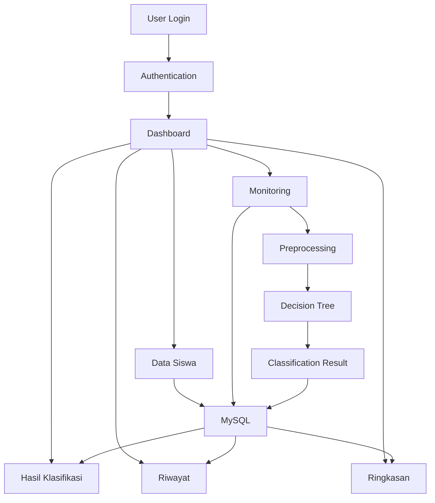

---

# 31. Aspek Keamanan Teknis

Rancangan keamanan awal:

1. Password disimpan menggunakan mekanisme hashing.
2. Endpoint membutuhkan autentikasi sesuai hak akses.
3. Input pengguna divalidasi sebelum diproses.
4. Data siswa dibatasi berdasarkan hak akses.
5. Error internal tidak ditampilkan secara detail kepada pengguna.
6. Informasi sensitif tidak dimasukkan ke dalam response API apabila tidak diperlukan.

---

# 32. Aspek Privasi

Data siswa merupakan data yang harus dikelola secara terbatas.

Rancangan privasi:

- hanya pengguna yang memiliki hak akses yang dapat melihat data;
- data digunakan sesuai kebutuhan sistem;
- data monitoring tidak dikirim ke layanan AI eksternal;
- logging tidak menyimpan data pribadi secara berlebihan;
- data hasil klasifikasi hanya ditampilkan kepada pengguna yang berwenang.

---

# 33. Batasan Implementasi

LLD awal ini memiliki beberapa bagian yang masih perlu ditentukan pada tahap berikutnya:

1. Atribut final data monitoring.
2. Kelas target Decision Tree.
3. Dataset training.
4. Teknik preprocessing final.
5. Parameter model Decision Tree.
6. Format final file export.
7. Struktur database final.
8. Detail hak akses pengguna.

Bagian tersebut tidak ditentukan secara sepihak dalam LLD awal karena harus disesuaikan dengan requirement, data penelitian, dan hasil analisis.

---

# 34. Rancangan Pengujian Awal

Pengujian sistem akan dilakukan terhadap fungsi utama.

| Fitur | Pengujian |
|---|---|
| Login | Kredensial benar dan salah |
| Data Siswa | Tambah, lihat, ubah, hapus |
| Monitoring | Input data valid dan tidak valid |
| Classification | Proses prediction |
| Result | Menampilkan hasil klasifikasi |
| History | Menampilkan riwayat |
| Summary | Menampilkan ringkasan |
| Filtering | Filter sesuai parameter |
| Export | Menghasilkan file |

---

# 35. Checklist LLD Awal

| Komponen | Status |
|---|---|
| Struktur modul | Selesai |
| Struktur backend | Selesai |
| Detail modul | Selesai |
| Alur proses | Selesai |
| Rancangan database | Selesai |
| Struktur data | Selesai |
| Spesifikasi API | Selesai |
| Validasi data | Selesai |
| Error handling | Selesai |
| Decision Tree flow | Selesai |
| Traceability | Selesai |
| Batasan implementasi | Selesai |

---

# 36. Kesimpulan

LLD awal ini menjadi acuan teknis untuk tahap implementasi Sistem Monitoring Evaluasi Belajar Siswa Berbasis Web Menggunakan Algoritma Decision Tree.

Rancangan menjelaskan struktur modul, alur data, database, API, proses preprocessing, proses Decision Tree, validasi, penanganan error, serta hubungan antara requirement dan komponen sistem.

Detail implementasi dapat diperbarui setelah requirement, dataset, indikator, dan rancangan model Decision Tree ditetapkan secara final.
