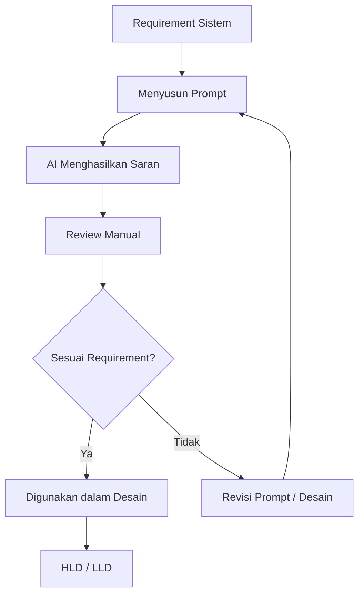

# PROMPT LOG

## Sistem Monitoring Evaluasi Belajar Siswa Berbasis Web Menggunakan Algoritma Decision Tree

**Versi:** 1.0  
**Status:** Draft Awal  
**Platform:** Web  
**Backend:** Python Flask  
**Database:** MySQL  
**Algoritma:** Decision Tree  

---

# 1. Tujuan Dokumentasi

Dokumen Prompt Log digunakan untuk mendokumentasikan penggunaan Artificial Intelligence (AI) sebagai alat bantu dalam proses perancangan sistem.

AI digunakan untuk membantu proses:

- menyusun struktur High-Level Design (HLD);
- menyusun struktur Low-Level Design (LLD);
- merancang arsitektur sistem;
- merancang alur data;
- merancang modul sistem;
- menyusun rancangan API;
- memeriksa hubungan antara requirement dan desain;
- membantu mengidentifikasi bagian desain yang masih perlu ditentukan.

Output AI tidak langsung digunakan tanpa pemeriksaan. Setiap hasil AI diperiksa kembali dan disesuaikan dengan requirement sistem.

---

# 2. Prinsip Penggunaan AI

Penggunaan AI dalam proses perancangan mengikuti prinsip berikut:

1. AI digunakan sebagai alat bantu perancangan.
2. Requirement sistem tetap menjadi dasar utama desain.
3. Output AI diperiksa secara manual.
4. AI tidak boleh mengubah requirement secara otomatis.
5. Informasi yang belum ditentukan tidak dianggap sebagai keputusan final.
6. Asumsi yang muncul selama proses desain harus ditandai.
7. Keputusan teknis final ditentukan berdasarkan kebutuhan sistem.
8. Prompt yang digunakan dalam proses perancangan dicatat pada dokumen ini.

---

# 3. Alur Penggunaan AI



---

# 4. Prompt 01 - Penyusunan Struktur HLD

## Tujuan

Meminta AI membantu menentukan struktur awal dokumen High-Level Design berdasarkan kebutuhan tugas.

## Prompt

```text
Saya sedang membuat sistem monitoring evaluasi belajar siswa berbasis web menggunakan algoritma Decision Tree.

Buatkan struktur High-Level Design (HLD) yang mencakup:
1. arsitektur sistem,
2. diagram alur data,
3. desain modul,
4. spesifikasi API tingkat tinggi,
5. keamanan,
6. deployment,
7. dokumentasi penggunaan AI.

Gunakan Python Flask sebagai backend, MySQL sebagai database, REST API sebagai komunikasi, dan Decision Tree sebagai algoritma klasifikasi.

HLD harus berada pada tingkat desain tinggi dan belum membahas source code secara detail.
```

## Hasil AI

AI menghasilkan struktur HLD yang mencakup:

- tujuan dokumen;
- ruang lingkup;
- pengguna sistem;
- arsitektur sistem;
- diagram alur data;
- modul sistem;
- alur Decision Tree;
- spesifikasi API;
- keamanan;
- deployment;
- traceability;
- penggunaan AI.

## Review Manual

Struktur diperiksa kembali agar sesuai dengan instruksi tugas.

Bagian yang tidak diperlukan pada tahap HLD tidak dijadikan detail implementasi.

## Keputusan

Struktur tersebut digunakan sebagai dasar penyusunan `hld.md`.

---

# 5. Prompt 02 - Perancangan Arsitektur Sistem

## Tujuan

Membantu merancang hubungan antara pengguna, web client, Flask, API, Decision Tree, dan database.

## Prompt

```text
Buatkan rancangan arsitektur untuk sistem monitoring evaluasi belajar siswa berbasis web.

Komponen yang digunakan:
- User
- Web Browser
- Flask Backend
- REST API
- Authentication
- Student Management
- Monitoring Service
- Classification Service
- Decision Tree
- MySQL Database

Tampilkan hubungan antar komponen dalam diagram yang dapat digunakan pada Markdown GitHub.
```

## Hasil AI

AI memberikan rancangan arsitektur dengan alur:

```text
User
↓
Web Browser
↓
Flask Backend
↓
REST API
↓
Service
↓
Decision Tree / Database
```

## Review Manual

Rancangan diperiksa agar Decision Tree tetap berada pada backend dan database digunakan sebagai tempat penyimpanan data.

## Keputusan

Arsitektur client-server digunakan dalam HLD.

---

# 6. Prompt 03 - Diagram Alur Data

## Tujuan

Membantu membuat diagram alur data sistem.

## Prompt

```text
Buatkan diagram alur data untuk sistem monitoring evaluasi belajar siswa.

Alur harus menunjukkan:
User → Web Client → Flask Backend → Validasi → Database → Monitoring → Preprocessing → Decision Tree → Hasil Klasifikasi → Database → Web Client.

Gunakan Mermaid agar diagram dapat di-preview di GitHub.
```

## Hasil AI

AI menghasilkan diagram alur menggunakan Mermaid.

## Review Manual

Diagram diperiksa untuk memastikan alur data sesuai dengan arsitektur sistem.

## Keputusan

Diagram Mermaid digunakan pada bagian Diagram Alur Data dalam `hld.md`.

---

# 7. Prompt 04 - Desain Modul

## Tujuan

Membantu mengidentifikasi modul yang diperlukan berdasarkan requirement sistem.

## Prompt

```text
Berdasarkan sistem monitoring evaluasi belajar siswa berbasis web menggunakan Decision Tree, buatkan daftar modul sistem beserta fungsi utamanya.

Fitur sistem:
- authentication;
- data siswa;
- monitoring;
- klasifikasi Decision Tree;
- hasil klasifikasi;
- riwayat monitoring;
- ringkasan monitoring;
- filtering;
- export.

Jangan menambahkan fitur di luar kebutuhan tersebut.
```

## Hasil AI

AI mengelompokkan fitur menjadi beberapa modul:

- Authentication;
- Student Management;
- Monitoring;
- Classification;
- Classification Result;
- Monitoring History;
- Monitoring Summary;
- Filtering;
- Export.

## Review Manual

Daftar modul dibandingkan dengan requirement yang tersedia.

## Keputusan

Modul yang sesuai digunakan dalam HLD dan LLD.

---

# 8. Prompt 05 - Rancangan LLD

## Tujuan

Membantu mengembangkan HLD menjadi rancangan Low-Level Design awal.

## Prompt

```text
Buatkan struktur Low-Level Design (LLD) awal berdasarkan HLD sistem monitoring evaluasi belajar siswa berbasis web menggunakan Flask, MySQL, REST API, dan Decision Tree.

LLD harus mencakup:
- struktur modul;
- struktur backend;
- alur proses;
- struktur data;
- rancangan database;
- API;
- validasi;
- error handling;
- proses Decision Tree;
- traceability requirement.

Jangan membuat source code lengkap.
```

## Hasil AI

AI menghasilkan struktur LLD yang lebih detail daripada HLD.

Bagian yang dihasilkan meliputi:

- struktur backend;
- detail modul;
- struktur data;
- database;
- API;
- preprocessing;
- Decision Tree;
- validasi;
- error handling.

## Review Manual

LLD diperiksa agar tidak berubah menjadi implementasi source code.

## Keputusan

Struktur tersebut digunakan sebagai dasar `lld-awal.md`.

---

# 9. Prompt 06 - Rancangan Database

## Tujuan

Membantu menyusun entitas awal database.

## Prompt

```text
Buatkan rancangan database awal untuk sistem monitoring evaluasi belajar siswa.

Entitas utama:
- User
- Student
- Monitoring
- Classification Result

Tampilkan field utama, tipe data, primary key, foreign key, dan hubungan antar entitas.

Rancangan masih bersifat awal dan jangan menentukan atribut monitoring yang belum ditetapkan dalam requirement.
```

## Hasil AI

AI menghasilkan rancangan awal dengan entitas:

- User;
- Student;
- Monitoring;
- Classification Result.

## Review Manual

Atribut monitoring tidak dibuat terlalu spesifik karena indikator penelitian masih dapat berubah berdasarkan data penelitian.

## Keputusan

Database digunakan sebagai rancangan awal dan dapat diperbarui pada tahap implementasi.

---

# 10. Prompt 07 - Spesifikasi API

## Tujuan

Membantu menyusun kontrak API awal.

## Prompt

```text
Buatkan rancangan REST API tingkat tinggi untuk sistem monitoring evaluasi belajar siswa.

Endpoint yang diperlukan:
- login;
- student;
- monitoring;
- classification;
- monitoring history;
- monitoring summary;
- filtering;
- export.

Untuk setiap endpoint berikan:
- method;
- endpoint;
- tujuan;
- contoh request;
- contoh response.

Gunakan JSON.
```

## Hasil AI

AI menghasilkan rancangan endpoint REST API menggunakan method GET, POST, PUT, dan DELETE sesuai kebutuhan fitur.

## Review Manual

Endpoint diperiksa agar tetap sesuai dengan fitur sistem.

## Keputusan

API digunakan sebagai rancangan awal dan detail implementasinya akan ditentukan pada tahap coding.

---

# 11. Prompt 08 - Proses Decision Tree

## Tujuan

Membantu menggambarkan proses penggunaan Decision Tree dalam sistem.

## Prompt

```text
Jelaskan alur penggunaan Decision Tree pada sistem monitoring evaluasi belajar siswa.

Alur harus mencakup:
data monitoring → validasi → preprocessing → Decision Tree → prediction → hasil klasifikasi → penyimpanan.

Tampilkan dalam diagram Mermaid dan penjelasan singkat.
```

## Hasil AI

AI menghasilkan alur:

```text
Data Monitoring
↓
Validasi
↓
Preprocessing
↓
Decision Tree
↓
Prediction
↓
Classification Result
↓
Database
```

## Review Manual

Alur dibandingkan dengan proses sistem yang dirancang.

## Keputusan

Alur digunakan pada HLD dan LLD.

---

# 12. Prompt 09 - Error Handling

## Tujuan

Membantu mengidentifikasi kondisi kegagalan yang perlu ditangani.

## Prompt

```text
Identifikasi kemungkinan error pada sistem monitoring evaluasi belajar siswa berbasis Flask dengan Decision Tree.

Pertimbangkan:
- input tidak valid;
- data siswa tidak ditemukan;
- database error;
- model Decision Tree tidak tersedia;
- model gagal melakukan prediction;
- authentication gagal.

Berikan penanganan tingkat tinggi tanpa membuat source code.
```

## Hasil AI

AI mengidentifikasi beberapa kondisi error:

- validation error;
- authentication error;
- data not found;
- database error;
- model error;
- prediction error.

## Review Manual

Error yang dipilih disesuaikan dengan kebutuhan sistem.

## Keputusan

Error handling dimasukkan ke dalam HLD dan LLD.

---

# 13. Prompt 10 - Traceability Requirement

## Tujuan

Memastikan setiap requirement memiliki bagian desain yang sesuai.

## Prompt

```text
Buatkan traceability antara requirement FR-01 sampai FR-10 dengan modul sistem.

Gunakan mapping:
FR → Modul → Komponen.

Jangan membuat requirement baru.
```

## Hasil AI

AI membuat hubungan antara requirement dengan modul seperti:

```text
FR-01 → Authentication
FR-02 → Student Management
FR-03 → Monitoring
FR-04 → Classification
FR-05 → Classification Result
FR-06 → Monitoring History
FR-07 → Monitoring Summary
FR-08 → Classification
FR-09 → Filtering
FR-10 → Export
```

## Review Manual

Mapping dibandingkan dengan requirement proyek.

## Keputusan

Mapping digunakan pada bagian traceability HLD dan LLD.

---

# 14. Prompt 11 - Pemeriksaan Konsistensi HLD dan LLD

## Tujuan

Memeriksa apakah rancangan HLD dan LLD memiliki struktur yang konsisten.

## Prompt

```text
Periksa rancangan HLD dan LLD sistem monitoring evaluasi belajar siswa.

Periksa:
1. Apakah semua modul HLD terdapat pada LLD?
2. Apakah API sesuai dengan modul?
3. Apakah alur Decision Tree konsisten?
4. Apakah database mendukung modul?
5. Apakah requirement memiliki hubungan dengan desain?

Jika terdapat bagian yang belum pasti, tandai sebagai bagian yang perlu ditentukan dan jangan membuat keputusan baru.
```

## Hasil AI

AI membantu mengidentifikasi hubungan antara:

- HLD;
- LLD;
- requirement;
- modul;
- API;
- database;
- Decision Tree.

## Review Manual

Hasil pemeriksaan digunakan sebagai masukan untuk memperbaiki dokumen desain.

## Keputusan

Perubahan hanya dilakukan apabila sesuai dengan requirement dan keputusan perancangan.

---

# 15. Ringkasan Prompt

| No | Prompt | Tujuan | Output |
|---|---|---|---|
| 1 | Struktur HLD | Menentukan struktur HLD | Struktur HLD |
| 2 | Arsitektur Sistem | Merancang komponen sistem | Diagram arsitektur |
| 3 | Alur Data | Merancang aliran data | Diagram Mermaid |
| 4 | Desain Modul | Mengidentifikasi modul | Daftar modul |
| 5 | LLD Awal | Menyusun rancangan teknis | Struktur LLD |
| 6 | Database | Merancang entitas | ERD dan tabel |
| 7 | API | Merancang API | Endpoint dan JSON |
| 8 | Decision Tree | Merancang alur klasifikasi | Flowchart |
| 9 | Error Handling | Mengidentifikasi error | Rancangan error |
| 10 | Traceability | Menghubungkan requirement | Mapping FR |
| 11 | Review HLD/LLD | Memeriksa konsistensi | Hasil review |

---

# 16. Pemeriksaan Manual

Setiap output AI diperiksa sebelum dimasukkan ke dokumen desain.

Pemeriksaan dilakukan terhadap:

- kesesuaian dengan requirement;
- kesesuaian dengan HLD;
- kesesuaian dengan LLD;
- konsistensi nama modul;
- konsistensi API;
- konsistensi database;
- konsistensi alur Decision Tree;
- kemungkinan adanya asumsi yang belum ditentukan.

---

# 17. Batasan Penggunaan AI

AI hanya digunakan sebagai alat bantu dalam proses perancangan.

AI tidak digunakan untuk:

- menentukan data penelitian tanpa sumber;
- membuat hasil penelitian;
- menentukan hasil klasifikasi nyata siswa;
- menggantikan keputusan pengembang;
- mengubah requirement secara otomatis;
- membuat kesimpulan penelitian.

Keputusan akhir mengenai sistem tetap berdasarkan requirement, kebutuhan penelitian, dan hasil validasi pengembang.

---

# 18. Keputusan yang Masih Perlu Ditentukan

Beberapa bagian masih berstatus rancangan awal dan perlu ditentukan pada tahap berikutnya:

1. Atribut final data monitoring.
2. Dataset yang digunakan.
3. Kelas target Decision Tree.
4. Parameter model.
5. Teknik preprocessing final.
6. Hak akses pengguna secara detail.
7. Struktur database final.
8. Format export final.

Bagian tersebut tidak ditetapkan oleh AI secara sepihak.

---

# 19. Kesimpulan

Penggunaan AI dalam proses perancangan membantu penyusunan struktur HLD, LLD, arsitektur, alur data, desain modul, API, database, proses Decision Tree, error handling, dan traceability.

Seluruh output AI tetap melalui pemeriksaan manual dan disesuaikan dengan requirement sistem sebelum digunakan dalam dokumen perancangan.
